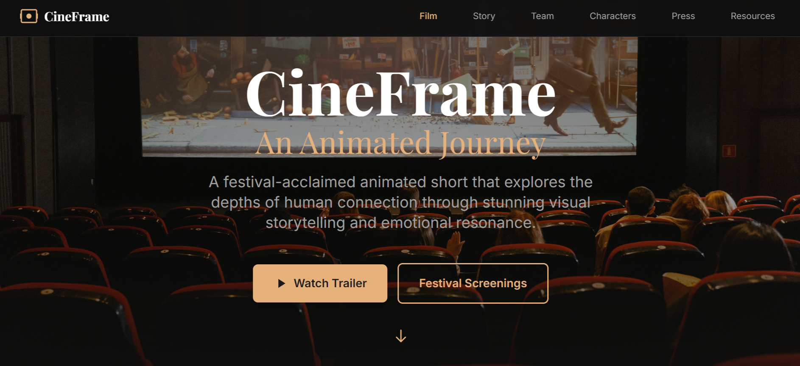
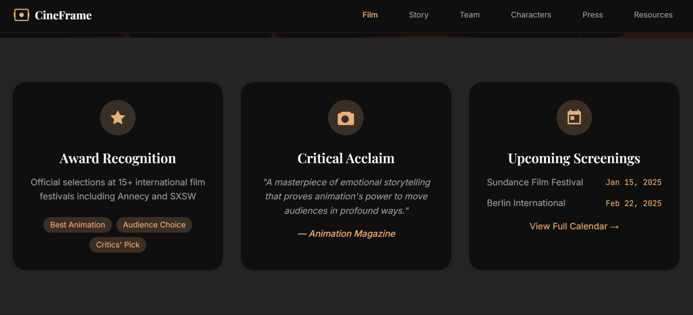
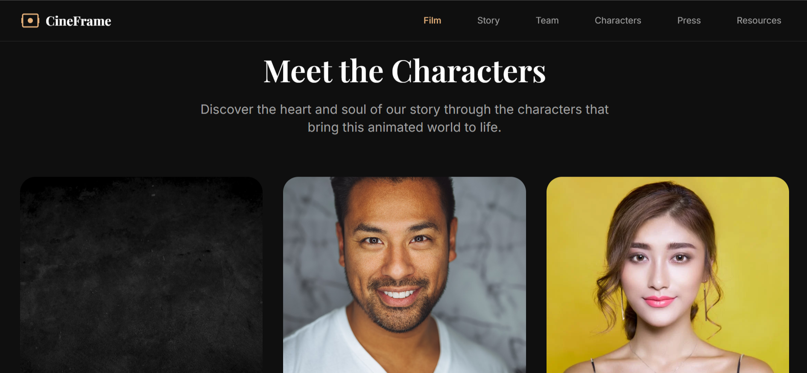
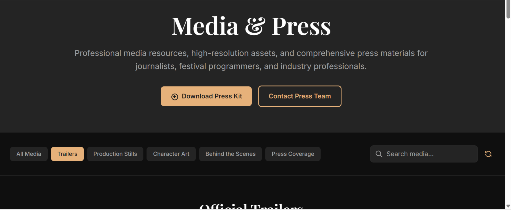
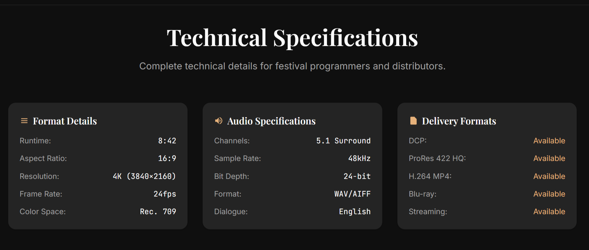

# 🎬 CineFrame

An award-winning animated short film website showcasing stunning visual storytelling and emotional resonance. Built with modern web technologies for an immersive digital experience.



## 🌟 About the Film

CineFrame is a festival-acclaimed animated short that explores the depths of human connection through breathtaking animation and compelling narrative. The film has been officially selected at 15+ international film festivals including prestigious venues like Annecy and SXSW.

## 🖼️ Visual Gallery

<div align="center">
  
  
</div>

<div align="center">
  
  
</div>

## 🚀 Features

- **Responsive Design** - Optimized for all devices and screen sizes
- **Interactive Character Gallery** - Meet Luna, Atlas, and Sage
- **Festival Calendar** - Track upcoming screenings and events
- **Behind-the-Scenes Content** - Explore the creative process
- **Press & Media Hub** - Access press kits and promotional materials
- **Modern UI/UX** - Built with Tailwind CSS for stunning visuals

## 🛠️ Tech Stack

- **HTML5** - Semantic markup and accessibility
- **Tailwind CSS** - Utility-first styling framework
- **Vanilla JavaScript** - Interactive components
- **Responsive Images** - Optimized media delivery
- **Custom Animations** - Smooth transitions and effects

## 📋 Prerequisites

- Node.js (v12.x or higher)
- npm or yarn

## 🚀 Quick Start

1. **Clone the repository**
```bash
git clone https://github.com/yourusername/cineframe.git
cd cineframe
```

2. **Install dependencies**
```bash
npm install
```

3. **Start development**
```bash
npm run dev
```

4. **Build for production**
```bash
npm run build:css
```

## 📁 Project Structure

```
cineframe/
├── css/
│   ├── tailwind.css      # Source styles with custom utilities
│   └── main.css          # Compiled CSS output
├── pages/
│   ├── homepage.html     # Main landing page
│   ├── about.html        # Film story and background
│   ├── characters.html   # Character profiles
│   ├── team.html         # Creative team bios
│   ├── media.html        # Press and festival info
│   └── resources.html    # Press kit and materials
├── reimage/              # Project screenshots and visuals
│   ├── ci1.png          # Main hero image
│   ├── ci2.png          # Character showcase
│   ├── ci3.png          # Animation process
│   ├── ci4.png          # Behind the scenes
│   └── ci5.png          # Festival screenings
├── public/
│   ├── favicon.ico      # Site icon
│   └── manifest.json    # PWA configuration
├── index.html           # Entry point with redirect
├── package.json         # Dependencies and scripts
└── tailwind.config.js   # Tailwind configuration
```

## 🎨 Design System

The website features a carefully crafted design system with:

- **Typography**: Playfair Display for headings, system fonts for body
- **Color Palette**: Cinematic dark theme with gold accents
- **Animations**: Smooth transitions and hover effects
- **Components**: Reusable UI elements for consistency

## 🏆 Awards & Recognition

- **15+ Festival Selections** - International recognition
- **Best Animation Award** - Multiple festival wins
- **Audience Choice** - Popular vote winner
- **Critics' Pick** - Professional acclaim

## 📱 Responsive Breakpoints

- `sm`: 640px+ (Mobile landscape)
- `md`: 768px+ (Tablet)
- `lg`: 1024px+ (Desktop)
- `xl`: 1280px+ (Large desktop)
- `2xl`: 1536px+ (Ultra-wide)

## 🤝 Contributing

We welcome contributions! Please feel free to submit issues and pull requests.

**CineFrame** - Where animation meets emotion. Experience the magic of storytelling through stunning visuals and compelling characters.

